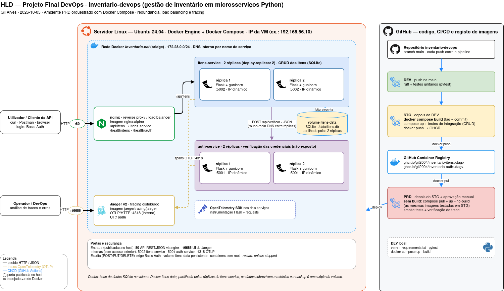

# Projeto Final DevOps — inventario-devops

**Autor:** Gil Alves · **Curso:** DevOps Engineering — Tokio School
**Repositório:** https://github.com/gil2004/inventario-devops

## 1. A aplicação

Gestor de inventário para pequenas empresas: regista o material, o stock ou o
equipamento da empresa (nome, quantidade e preço). Qualquer pessoa pode consultar
a lista, mas só quem tem login pode criar, alterar ou apagar itens.

**Porque é útil para uma startup:** substitui folhas de Excel partilhadas por uma
API com controlo de acesso, testada automaticamente, com redundância e
monitorização, pronta a crescer sem mudar a forma como é entregue.

A aplicação é composta por dois microsserviços Python (Flask), que comunicam por
HTTP com respostas em JSON:

| Serviço | Função | Endpoints |
|---|---|---|
| **itens-service** (5002) | CRUD dos itens | `GET /api/itens` · `GET /api/itens/<id>` · `POST /api/itens` · `PUT /api/itens/<id>` · `DELETE /api/itens/<id>` |
| **auth-service** (5001) | verificação do utilizador e da palavra-passe | `POST /api/verificar` (só interno) |

Para criar, alterar ou apagar, o pedido leva as credenciais (Basic Auth). O
itens-service pergunta ao auth-service se estão corretas antes de executar a
operação; se não estiverem, responde **401**.

## 2. Arquitetura

- **nginx** — única porta de entrada (:80), reverse proxy e load balancer.
- **itens-service** e **auth-service** — 2 réplicas cada, na rede interna `inventario-net`.
- O auth-service não é acessível do exterior.
- **Jaeger** — rastreamento das transações entre os serviços *(a completar)*.
- **GitHub Actions** — pipeline DEV → STG → PRD *(a completar)*.

## 3. Ferramentas e bibliotecas

| Ferramenta | Utilização |
|---|---|
| Python 3.12 + venv | linguagem e ambiente virtual |
| Flask | APIs REST |
| requests | chamada do itens-service ao auth-service |
| gunicorn | servidor de produção nos containers |
| pytest, pytest-cov, requests-mock | testes, cobertura e simulação de serviços |
| ruff | lint |
| Docker + Docker Compose | containers, réplicas e orquestração |
| nginx | reverse proxy e load balancer |
| Git + GitHub | repositório local e remoto |
| Make | um comando por passo |

## 4. Decisões de design

- **App simples de inventário** — CRUD completo e login, sem complexidade de negócio.
- **Basic Auth** — o mais simples para uma API usada com `curl`; em produção real
  exigiria HTTPS, porque a palavra-passe viaja em cada pedido.
- **Credenciais em variáveis de ambiente** (`ADMIN_USER`, `ADMIN_PASSWORD`), não fixas no código.
- **Só a branch `main`** — cada push corre DEV → STG → PRD; produção protegida por aprovação manual.
- **Um único `docker-compose.yml`** para os três ambientes: `build` (DEV e STG) e
  `image` no GitHub Container Registry (PRD, sem build).
- **Redundância** — 2 réplicas por serviço atrás do nginx, com `restart: unless-stopped`.
- **auth-service não exposto** — só o itens-service lhe acede, pela rede interna.
- **Containers sem root** — utilizador `appuser` nos Dockerfiles.

## 5. Passos de implementação

Cada passo é executado com o Makefile (`make help` lista todos os targets).

### Passo 1 — Estrutura e ambiente virtual · `make setup`

Cria o venv e instala as dependências do `requirements.txt`.

### Passo 2 — Testes unitários · `make test`

Corre o lint (ruff) e os testes unitários dos dois serviços. No itens-service, o
auth-service é simulado com `requests-mock`, para testar cada serviço isoladamente.

Resultado: **auth-service 5 testes · itens-service 17 testes, todos aprovados.**

### Passo 3 — Teste local dos dois serviços

Com os dois serviços a correr fora de containers, foi feito o ciclo completo do
CRUD com login: listar, criar (201), alterar (200), apagar (204) e uma tentativa
com a palavra-passe errada (401). Cada pedido com login gerou um
`POST /api/verificar` no auth-service, o que confirma a comunicação entre os dois
microsserviços.

### Passo 4 — Repositório local e remoto

Repositório Git local ligado ao GitHub (`inventario-devops`), com uma só branch, `main`.

### Passo 5 — Ambiente DEV com containers · `make dev`

Cada serviço tem um Dockerfile (`python:3.12-slim`, utilizador sem privilégios,
gunicorn). O `docker-compose.yml` constrói as imagens localmente e arranca o nginx
e 2 réplicas de cada serviço (5 containers).

### Passo 6 — Redundância · `make redundancia`

Uma réplica do itens-service é parada e a API continua a responder através da outra.

### Passo 7 — Dados partilhados entre réplicas (SQLite em volume) *(a completar)*
### Passo 8 — Rastreamento com Jaeger *(a completar)*
### Passo 9 — STG: build das imagens e testes de integração · `make stg` *(a completar)*
### Passo 10 — PRD: deploy sem build e utilização · `make prd` · `make demo` *(a completar)*
### Passo 11 — Pipeline GitHub Actions *(a completar)*
### Passo 12 — Paragem, destruição e limpeza · `make clean` *(a completar)*

## 6. Evidências

| Teste | Onde | Resultado |
|---|---|---|
| Unitários auth-service | local | 5 aprovados |
| Unitários itens-service | local | 17 aprovados |
| CRUD com login entre os dois serviços | local | criar 201 · alterar 200 · apagar 204 · credenciais erradas 401 |
| Redundância | Docker Compose | com uma réplica parada, a API continuou a responder |

## 7. Problemas encontrados

| Problema | Causa | Solução |
|---|---|---|
| Depois de parar uma réplica, a lista de itens veio vazia em vez de mostrar o item criado | cada réplica guardava os itens na sua própria memória; o item ficou na réplica parada e a outra nunca o conheceu | guardar os itens numa base de dados SQLite num volume Docker partilhado pelas réplicas *(passo 7)* |